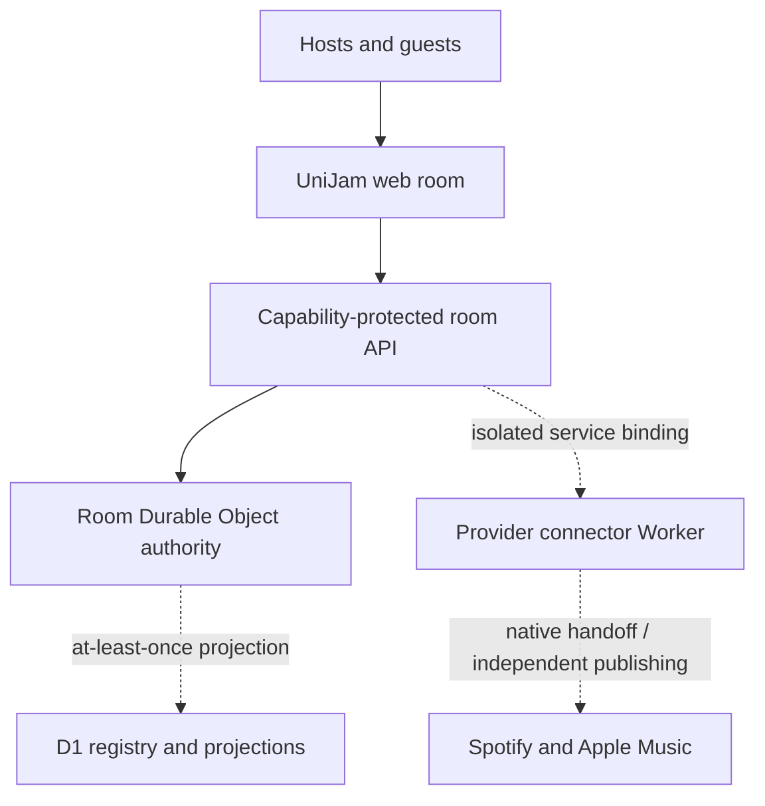

# UniJam

<p align="center">
  <strong>One room. Every guest. Their preferred music app. One host speaker.</strong>
</p>

<p align="center">
  <a href="https://github.com/masonwyatt23/unijam/actions/workflows/ci.yml"></a>
  <a href="LICENSE"></a>
  
</p>

UniJam is an open-source, real-time music room for groups split between Spotify
and Apple Music. A guest opens one link, picks a nickname, and helps shape the
same queue—without creating a UniJam account or forcing the group onto one
streaming service.

The room is the source of truth. Spotify and Apple Music are native playback
handoffs and optional publishing destinations, not the collaboration database.

> [!IMPORTANT]
> The pilot implementation is complete, but production activation is deliberately
> gated. Cloudflare resource IDs and secrets must be provisioned, credentialed
> provider contract tests and load gates must pass, and only then may the
> `unijam.ashlr.ai` child zone be delegated. See
> [`docs/PILOT_RELEASE.md`](docs/PILOT_RELEASE.md).

## Why UniJam exists

Mixed-platform groups still coordinate music through text messages, pasted
links, duplicate searches, and one person's phone. Playlist transfer tools solve
what happens *after* a playlist exists. UniJam focuses on the unsolved moment
before that: deciding together what plays next.

## Pilot capabilities

- Passkey-only host accounts with recovery codes, additional credentials, and
  recent-passkey confirmation for sensitive actions
- Account-free guest joins that exchange fragment capabilities once for opaque,
  secure, HttpOnly sessions
- One SQLite-backed Durable Object authority per room, with hibernating
  WebSockets, HTTP fallback, replay-safe commands, snapshots, outbox, and D1
  projection
- A continuous **Now → Next → Staged → Held → Played** setlist with stable
  recording, suggestion, and occurrence identities
- US storefront resolution for Spotify and Apple Music links, provider IDs,
  ISRCs, and plain-text intent, with honest ambiguity and version holds
- Host-confirmed native playback handoffs—opening a link is never treated as
  proof that audio played
- Independent private-playlist publishing, retry, reconciliation, cancellation,
  kill switches, and dead-letter recovery for Spotify and Apple Music
- Isolated connector secrets, encrypted provider tokens, provider disconnect
  purge, 30-day detailed retention, and a lossless alpha-room claim path
- Dedicated responsive, accessible guest and host flows with official provider
  artwork only in approved, linked contexts

## Product model



UniJam records a native handoff as requested or opened. It never claims verified
playback until the host explicitly confirms it. Provider playlists remain
projections of UniJam state so an API outage or platform limitation cannot
corrupt the collaborative queue.

The complete system design is in [`docs/ARCHITECTURE.md`](docs/ARCHITECTURE.md).
Verified provider constraints and copy rules are in
[`docs/CONNECTOR_BOUNDARIES.md`](docs/CONNECTOR_BOUNDARIES.md).

## Core invariants

1. **The room is authoritative.** Provider playlists never become the room
   database.
2. **Identity is server-bound.** A shared invite is exchanged for a short-lived
   participant session before actions are accepted.
3. **Retries are safe.** Events use stable IDs and conflicting reuse is rejected.
4. **Playback claims are honest.** Opening a deep link is not verified playback.
5. **Failures stay isolated.** Spotify and Apple operations progress independently.
6. **Ambiguity pauses publishing.** A questionable catalog match requires review.

## Stack

- Next.js 16 and React 19
- TypeScript
- Vinext and Vite on the Cloudflare Worker runtime
- Cloudflare Durable Objects with SQLite, D1, Queues, DLQs, cron, and WebSockets
- Drizzle ORM and migrations
- SimpleWebAuthn, Web Crypto, MusicKit, and Spotify PKCE
- Node test, Workers Vitest, Playwright, axe, Semgrep, and gitleaks

## Quick start

### Prerequisites

- Node.js 24 or newer
- npm
- Linux or WSL for the bounded build helpers

```bash
git clone https://github.com/masonwyatt23/unijam.git
cd unijam
npm ci
npm run dev
```

Local development uses non-production bindings and keeps provider feature flags
closed unless connector credentials are explicitly supplied. It never simulates
a successful provider connection.

## Quality gates

```bash
npm run lint
npm test
npm run test:e2e
npm run validate:release-config
```

`npm test` runs type checking, domain, platform, real Workers-runtime, provider,
UI, release-operation, build, and rendered-output suites. GitHub Actions also
builds isolated staging and production artifacts and runs Chromium/WebKit
accessibility flows.

## Repository map

| Path | Purpose |
| --- | --- |
| `app/` | Product UI and room API routes |
| `worker/` | Web Worker entrypoint and authoritative room Durable Object |
| `connectors/` | Isolated provider auth, token storage, publishing, and reconciliation Worker |
| `lib/catalog/`, `lib/providers/`, `lib/publishing/` | Resolution, handoff, and destination engines |
| `lib/platform/`, `lib/server/` | Protocol, passkeys, sessions, migration, security, and projection boundaries |
| `db/`, `drizzle/`, `connectors/migrations/` | Web and connector D1 schemas and migrations |
| `docs/` | Architecture, connector policy, platform, and pilot release runbooks |
| `tests/` | Workers, browser, accessibility, rendered, and release verification |

## Release posture

The next work is operational rather than simulated feature expansion: provision
isolated Cloudflare staging resources, install real provider credentials, run
remote D1/Queue and provider contracts, complete WebSocket revocation assurance,
pass the 10×20 smoke and 60-minute soak, and then delegate only the
`unijam.ashlr.ai` child zone. Public discovery, synchronized audio, native apps,
billing, and generalized library management remain intentionally out of scope.

## Contributing

Contributions are welcome, especially around room correctness, accessibility,
catalog resolution using properly licensed data, provider adapters, and test
coverage. Read [`CONTRIBUTING.md`](CONTRIBUTING.md) before opening a pull request.

Please do not send Spotify content, metadata, artwork, audio features, or
playlist contents into an AI/ML system. The provider-policy rationale is
documented in [`docs/CONNECTOR_BOUNDARIES.md`](docs/CONNECTOR_BOUNDARIES.md).

## Security

Do not open a public issue for a vulnerability. Use GitHub's private
vulnerability reporting flow as described in [`SECURITY.md`](SECURITY.md).

## License

Licensed under the [Apache License 2.0](LICENSE).

Spotify and Apple Music are trademarks of their respective owners. UniJam is
not affiliated with, endorsed by, or sponsored by Spotify or Apple.
