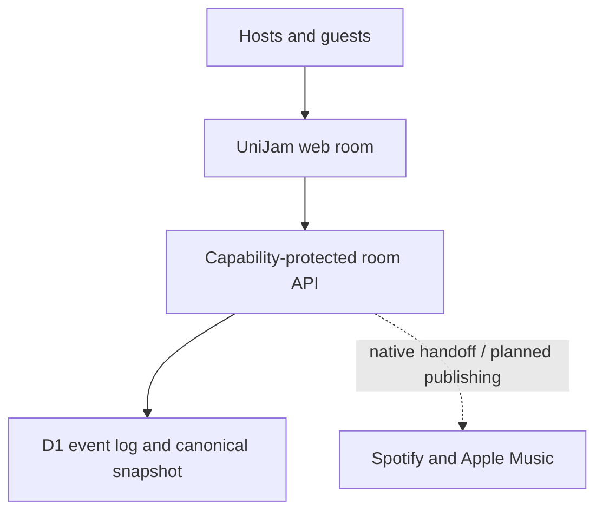

# UniJam

<p align="center">
  <strong>One room. Every guest. Their preferred music app. One host speaker.</strong>
</p>

<p align="center">
  <a href="https://github.com/masonwyatt23/unijam/actions/workflows/ci.yml"></a>
  <a href="LICENSE"></a>
  
</p>

UniJam is an open-source, real-time music room for groups split between Spotify
and Apple Music. A guest opens one link, picks a nickname, and helps shape the
same queue—without creating a UniJam account or forcing the group onto one
streaming service.

The room is the source of truth. Spotify and Apple Music are native playback
handoffs and optional publishing destinations, not the collaboration database.

> [!IMPORTANT]
> UniJam is an alpha product and integration prototype. Durable cross-browser
> room state works today. Spotify OAuth, Apple MusicKit, neutral catalog
> resolution, and production playlist publishing are not connected yet.

## Why UniJam exists

Mixed-platform groups still coordinate music through text messages, pasted
links, duplicate searches, and one person's phone. Playlist transfer tools solve
what happens *after* a playlist exists. UniJam focuses on the unsolved moment
before that: deciding together what plays next.

## What works today

- Shareable rooms with opaque IDs and separate host and guest capabilities
- Account-free guest joins with participant-scoped sessions
- Authoritative participants, suggestions, approvals, votes, reactions,
  readiness, handoffs, and activity state
- Fair-turn queue mechanics and per-participant contribution limits
- Spotify, Apple Music, or ask-each-time service preferences
- Cross-browser convergence through an ordered, replay-safe event log
- Optimistic interactions with canonical rollback when an action is rejected
- Link locks, expiration, rotation, host approval, heartbeat presence, and
  database-backed rate limits
- Provider-aware publishing previews and explicit unresolved-match holds

## Product model



UniJam records a native handoff as requested or opened. It never claims verified
playback until the host explicitly confirms it. Provider playlists remain
projections of UniJam state so an API outage or platform limitation cannot
corrupt the collaborative queue.

The complete system design is in [`docs/ARCHITECTURE.md`](docs/ARCHITECTURE.md).
Verified provider constraints and copy rules are in
[`docs/CONNECTOR_BOUNDARIES.md`](docs/CONNECTOR_BOUNDARIES.md).

## Core invariants

1. **The room is authoritative.** Provider playlists never become the room
   database.
2. **Identity is server-bound.** A shared invite is exchanged for a short-lived
   participant session before actions are accepted.
3. **Retries are safe.** Events use stable IDs and conflicting reuse is rejected.
4. **Playback claims are honest.** Opening a deep link is not verified playback.
5. **Failures stay isolated.** Spotify and Apple operations progress independently.
6. **Ambiguity pauses publishing.** A questionable catalog match requires review.

## Stack

- Next.js 16 and React 19
- TypeScript
- Vinext and Vite on the Cloudflare Worker runtime
- Cloudflare D1
- Drizzle ORM and migrations
- Tailwind CSS 4
- Node's built-in test runner

## Quick start

### Prerequisites

- Node.js 24 or newer
- npm
- Linux or WSL for the bounded build helpers

```bash
git clone https://github.com/masonwyatt23/unijam.git
cd unijam
npm ci
npm run dev
```

The local runtime provides a D1 binding from `.openai/hosting.json`. No Spotify
or Apple credentials are required for the current prototype experience.

## Quality gates

```bash
npm run lint
npm run typecheck
npm run test:domain
npm test
```

`npm test` runs type checking, the domain and security suites, a verified
production build, and rendered HTML validation. GitHub Actions runs the same
release gate on pushes and pull requests.

## Repository map

| Path | Purpose |
| --- | --- |
| `app/` | Product UI and room API routes |
| `lib/room-engine.ts` | Catalog normalization, fair queueing, and publishing plans |
| `lib/live-room-events.ts` | Event contract and validation |
| `lib/live-room-snapshot.ts` | Deterministic event projection |
| `lib/server/` | Capability auth, participant sessions, persistence, and rate limits |
| `db/` and `drizzle/` | D1 schema and migrations |
| `docs/` | Architecture, roadmap, and provider constraints |
| `tests/` | Rendered-product validation |

## Roadmap

- Canonical queue occurrences so approved suggestions become playable entries
- Storefront-aware neutral catalog resolution
- Direct Spotify and Apple Music track handoffs
- Durable per-destination publishing outboxes and reconciliation
- Real invite-only mixed-platform room pilots

See [`docs/ROADMAP.md`](docs/ROADMAP.md) for sequencing and acceptance criteria.

## Contributing

Contributions are welcome, especially around room correctness, accessibility,
catalog resolution using properly licensed data, provider adapters, and test
coverage. Read [`CONTRIBUTING.md`](CONTRIBUTING.md) before opening a pull request.

Please do not send Spotify content, metadata, artwork, audio features, or
playlist contents into an AI/ML system. The provider-policy rationale is
documented in [`docs/CONNECTOR_BOUNDARIES.md`](docs/CONNECTOR_BOUNDARIES.md).

## Security

Do not open a public issue for a vulnerability. Use GitHub's private
vulnerability reporting flow as described in [`SECURITY.md`](SECURITY.md).

## License

Licensed under the [Apache License 2.0](LICENSE).

Spotify and Apple Music are trademarks of their respective owners. UniJam is
not affiliated with, endorsed by, or sponsored by Spotify or Apple.
