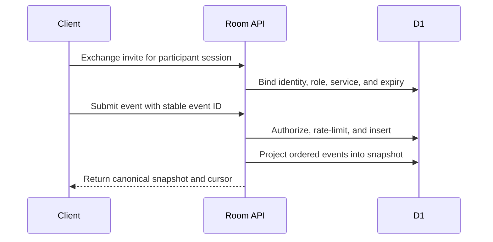
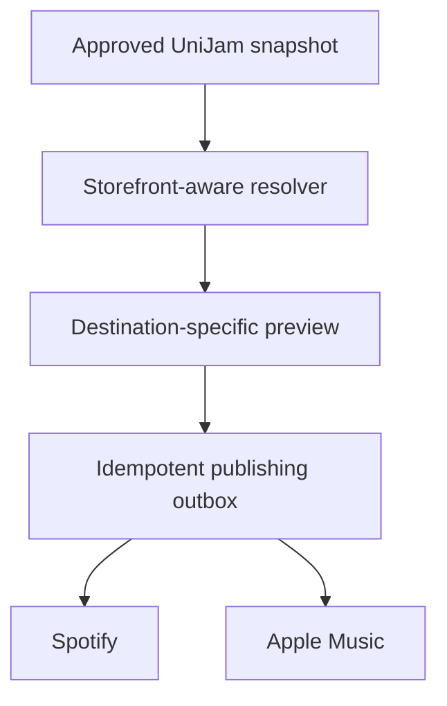

# UniJam architecture

This document describes the current room platform and the boundary for future
Spotify and Apple Music connectors.

## System responsibility

UniJam is the collaboration authority. It owns:

- Room identity and policy
- Participant identity, role, and presence
- Suggestions, approvals, votes, and fair ordering
- Playback handoff state
- Activity history
- Match and publishing decisions

Provider playlists are projections. They may lag, disconnect, or fail without
changing the canonical room.

## Request flow

Clients may render optimistic feedback, but the server snapshot wins. A rejected
action rolls back to canonical state with a user-visible reason.

## Capability and session model

1. A host creates an opaque room ID, a host capability, and a guest capability.
2. Only capability hashes are persisted.
3. A guest capability is delivered in the URL fragment so it is not sent in
   ordinary HTTP referrers.
4. The capability is exchanged for a short-lived participant session.
5. The server binds nickname, room role, participant role, preferred service,
   session epoch, and expiry to that identity.
6. Invite rotation increments the security boundary and invalidates sessions.

The API never trusts actor name, role, or participant ID supplied by an event
body. Those values come from the authenticated participant session.

## Event model

Room changes are immutable events keyed by `(room_id, event_id)`. The server
rejects reuse of an event ID for different content or by a different actor.

The ordered reducer builds a compact canonical snapshot containing participants,
suggestions, votes, readiness, reactions, playback phase, and queue position.
Snapshot writes use compare-and-swap semantics so concurrent projectors converge.

Important event properties:

- Payloads are normalized and size bounded.
- Commands are role scoped.
- Duplicate delivery is a no-op.
- Out-of-order or stale sequences cannot roll state backward.
- Track-scoped actions are rejected after the current track changes.
- Votes are participant sets, not increment-only counters.

## Presence and rate limiting

Participant sessions carry `last_seen_at_ms`. Presence is active only while a
session is unexpired and its heartbeat is recent.

Rate limits use atomic D1 buckets at three scopes:

- Entire room
- Participant across all actions
- Participant for the specific action type

This prevents a concurrent request burst from bypassing an application-level
count.

## Provider connector boundary

The connector layer will use a durable outbox per destination:

Each destination progresses independently through validation, authorization,
publishing, retry, reconnect, and reconciliation. A failure at Apple must not
block Spotify or the room itself.

See [`CONNECTOR_BOUNDARIES.md`](CONNECTOR_BOUNDARIES.md) for verified API
capabilities and policy constraints.

## Matching contract

Matching starts with identifiers and neutral metadata:

1. Exact ISRC candidate lookup
2. Artist, title, album, duration, and version scoring
3. Storefront availability verification
4. Ambiguity hold and user confirmation
5. Persisted user correction with provenance

Live, remix, clean, explicit, deluxe, and regional recordings remain distinct
unless evidence supports equivalence. One provider match never proves that a
track exists in another listener's storefront.

## Deployment shape

- Next.js and React application compiled by Vinext
- Cloudflare Worker request runtime
- D1 persistence through the `DB` binding
- Drizzle schema and checked-in migrations
- Static assets bundled with the worker artifact

## Known limitations

- The visible queue still uses seeded demo tracks rather than canonical queue
  occurrences created from approved suggestions.
- Provider authorization and writes are not active.
- Event delivery uses polling rather than a push transport.
- Snapshot refresh currently happens in the request path.
- Public identity and abuse systems are intentionally minimal for the alpha.
